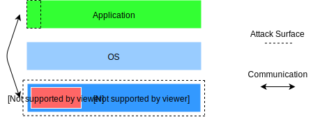

Intel Software Extensions Guard (SGX)
=====================================

.. contents:: Table of Contents

What is SGX?
------------

With the emergence of Cloud Computing, the privacy of the data manipulated appeared to be a
major topic.

| In order to bring a solution, Intel created a new Instruction Set Architecture: SGX.
| It allows creating private memory areas which can't be read or modified by the system,
  these areas as encrypted, and only decrypted in the CPU to limit the attack surface to the hardware:

| These memory areas can only be read/updated by the code they were associated with at their creation.

How does the encryption work?
-----------------------------

Each Intel CPU ships two private keys:

- The *Root Sealing Key* which is used to encrypt the memory and seal data in long term memories.
- The *Root Provisioning Key* which is used to attest the SGX platform is genuine to third parties.

Actually, the *Root Sealing Key* is derivated by the CPU based on a hash of the code executed before being used to encrypt the memory.
Thus, different applications won't be able to read the other private memory area.

| You may read `this article<https://blog.quarkslab.com/overview-of-intel-sgx-part-1-sgx-internals.html>`_ as an
  introduction to SGX internals, the way it manages memory and the instructions used.
| For even further details, you may check out `this document<https://eprint.iacr.org/2016/086.pdf>`_ produced
  by two researchers.
